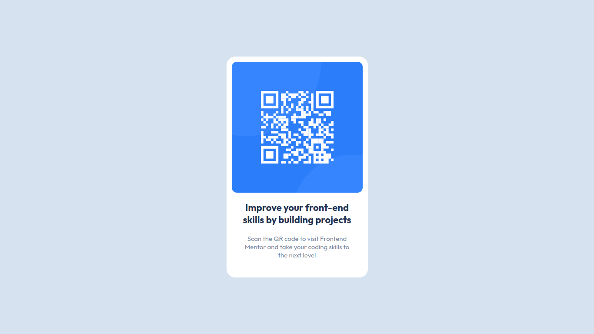

# Frontend Mentor - QR code component solution

This is a solution to the [QR code component challenge on Frontend Mentor](https://www.frontendmentor.io/challenges/qr-code-component-iux_sIO_H), probably the most basic project 
available there.

## Table of contents

- [Overview](#overview)
  - [Screenshot](#screenshot)
  - [Links](#links)
- [My process](#my-process)
  - [What I learned](#what-i-learned)
- [Author](#author)

## Overview

### Screenshot




### Links

- Live Site URL: [https://oczywsziysya.github.io/fem-qr-code-component](https://oczywsziysya.github.io/fem-qr-code-component)

## My process

### What I learned

Doing this project I came across a very common problem: the body container's height 
was smaller than the window's, since there wasn't enough content to make the body
stretch. The main thing I learned during the project is that I can solve this issue 
by adding some attributes to the html and body elements: 

```css
html {
  height: 100%;
}

body {
  min-height: 100%;
}
```

This also allows the body to stretch if the content's height is greater than the
window's height. I'm not sure whether this is the ideal solution to the problem,
but it works for now.

## Author

- Frontend Mentor - [@Oczywsziysya](https://www.frontendmentor.io/profile/Oczywsziysya)

