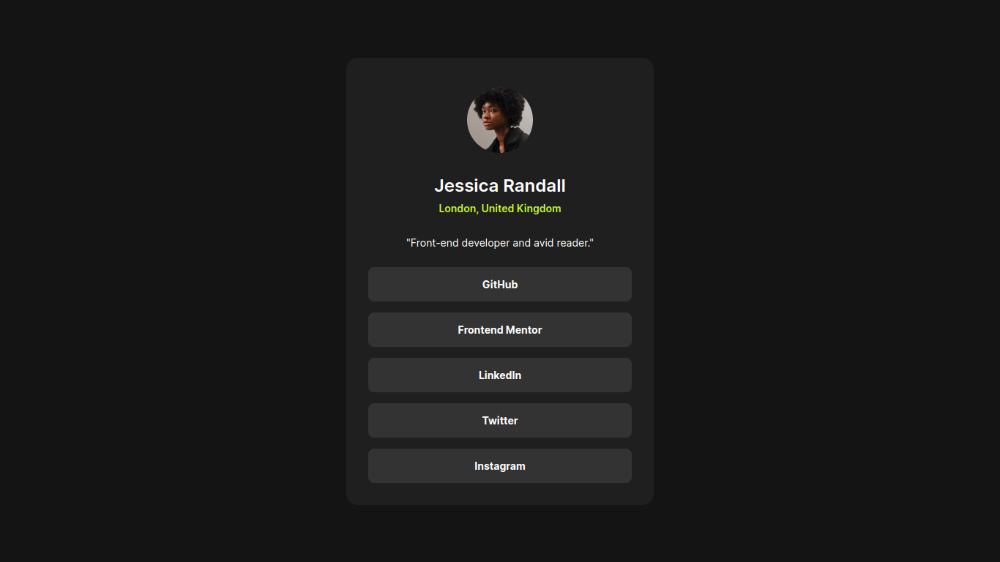
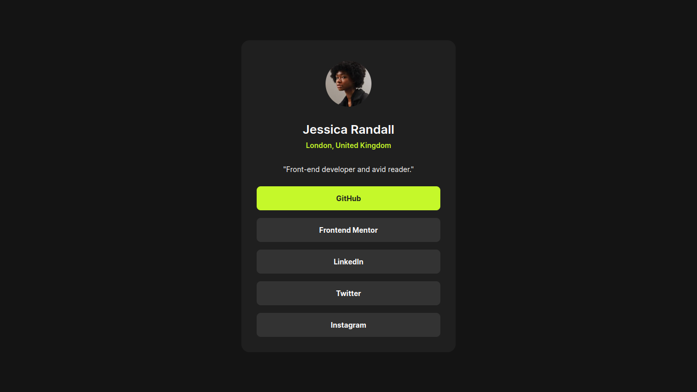
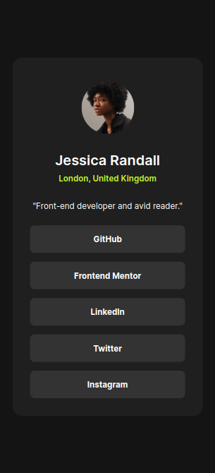

# Frontend Mentor - Social links profile solution

This is a solution to the [Social links profile challenge on Frontend Mentor](https://www.frontendmentor.io/challenges/social-links-profile-UG32l9m6dQ).

## Table of contents

- [Overview](#overview)
  - [The challenge](#the-challenge)
  - [Screenshot](#screenshot)
    - [Desktop](#desktop)
    - [Desktop (active state)](#desktop-active-state)
    - [Mobile (~375 pixels width)](#mobile-375-pixels-width)
  - [Links](#links)
- [My process](#my-process)
  - [Built with](#built-with)
  - [Continued development](#continued-development)
- [Author](#author)

## Overview

### The challenge

Users should be able to:

- See hover and focus states for all interactive elements on the page

### Screenshot

#### Desktop

#### Desktop (active state)

#### Mobile (~375 pixels width)

### Links

- Live Site URL: [https://oczywsziysya-fem-02.netlify.app](https://oczywsziysya-fem-02.netlify.app)

## My process

### Built with

- Semantic HTML5 markup
- CSS custom properties
- Flexbox

### Continued development

Some aspects that I want to refine for next projects:

* Semantic HTML
* Responsive design
* Write cleaner and concise CSS

## Author

- Frontend Mentor profile - [@Oczywsziysya](https://www.frontendmentor.io/profile/Oczywsziysya)