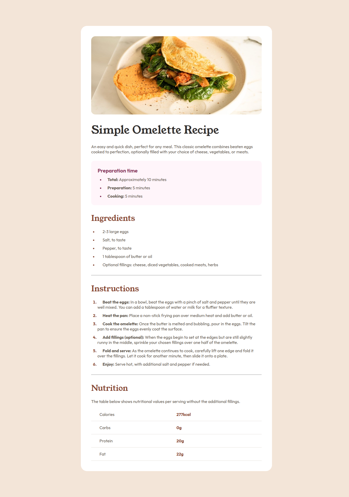
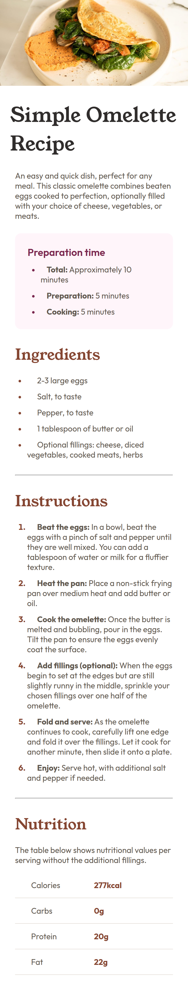

# Frontend Mentor - Recipe page solution

This is a solution to the [Recipe page challenge on Frontend Mentor](https://www.frontendmentor.io/challenges/recipe-page-KiTsR8QQKm).
## Table of contents

- [Overview](#overview)
  - [Screenshot](#screenshot)
    - [Desktop](#desktop)
    - [Mobile (~375px width screen)](#mobile-375px-width-screen)
  - [Links](#links)
- [My process](#my-process)
  - [Built with](#built-with)
  - [What I learned](#what-i-learned)
  - [Continued development](#continued-development)
  - [Useful resources](#useful-resources)
- [Author](#author)

## Overview

### Screenshot

#### Desktop

#### Mobile (~375px width screen)

### Links

- Live Site URL: [https://oczywsziysya.github.io/fem-recipe-page](https://oczywsziysya.github.io/fem-recipe-page)

## My process

### Built with

- Semantic HTML5 markup
- CSS custom properties
- Flexbox

### What I learned

The main thing I learned to complete this challenge is how to deal with HTML tables. Of course I 
could pretty much achieve the same design without using a table to present the content, but this 
wouldn't be correct semantically: it is, in fact, a table, so it should be written as so. 
I learned about tags like: 

* table/tr/td/th (the basic components for a table)
* thead/tbody/tfoot (to facilitate the styling process only, these have no semantic meaning associated to them)
* caption (important for both sighted and non-sighted users)
* colgroup/col (useful for applying styles to whole columns)
* \[attribute\] span (can make a single cell fill other cells as well)

Regarding accessibility, I learned about the 'scope' attribute that should be added to headers. It helps screen readers to understand the table's structure, so it's very important for the non-sighted users. It accepts the values 'row/col/rowgroup/colgroup', to indicate whether the that's a header for a row or for a column. 'rowgroup/colgroup' are used if the header is extended to other cells by using the 'span' attribute.

### Continued development

* I feel like my CSS is messy and chaotic and this really bothers me, so I want to continuously develop my ability to write clean and concise code.
* Learn more about responsive design.
* I really should learn more about other types of length units and when I should use them. For this and the previous FEM projects I've been using only pixels for margins, paddings and font-sizes and something tells me that this is not the ideal. Maybe using other units like '%', 'em/rem' or even 'vw/vh' would help the design to be more responsive.

### Useful resources

- [HTML table basics by MDN](https://developer.mozilla.org/en-US/docs/Learn/HTML/Tables/Basics) - "This article gets you started with HTML tables, covering the very basics such as rows, cells, headings, making cells span multiple columns and rows, and how to group together all the cells in a column for styling purposes."
- [HTML table advanced features and accessibility by MDN](https://developer.mozilla.org/en-US/docs/Learn/HTML/Tables/Advanced) - "In the second article in this module, we look at some more advanced features of HTML tables — such as captions/summaries and grouping your rows into table head, body and footer sections — as well as looking at the accessibility of tables for visually impaired users."
- [Styling HTML tables by MDN](https://developer.mozilla.org/en-US/docs/Learn/CSS/Building_blocks/Styling_tables) - "Styling an HTML table isn't the most glamorous job in the world, but sometimes we all have to do it. This article provides a guide to making HTML tables look good, with some specific table styling techniques highlighted."

## Author

- Frontend Mentor - [@Oczywsziysya](https://www.frontendmentor.io/profile/Oczywsziysya)
