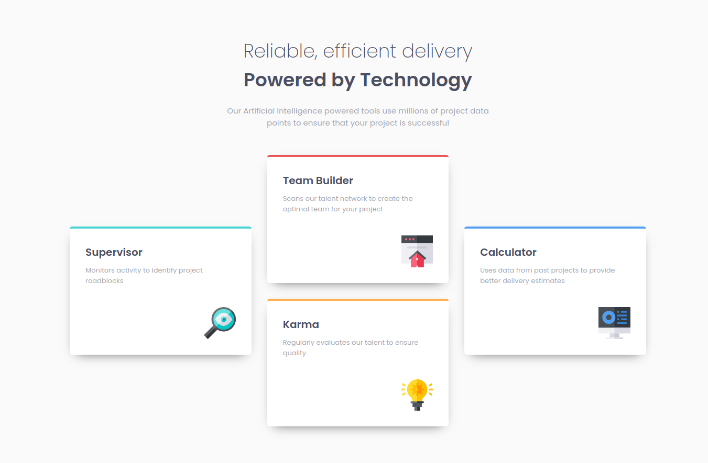
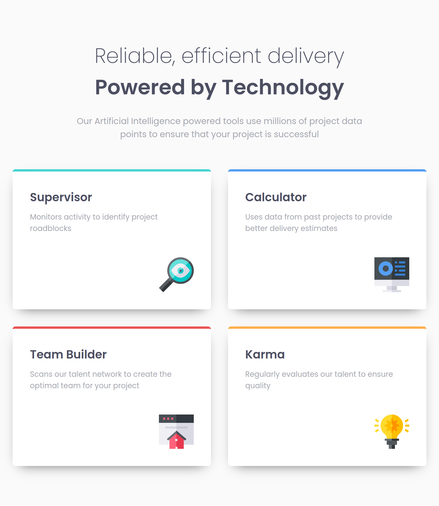
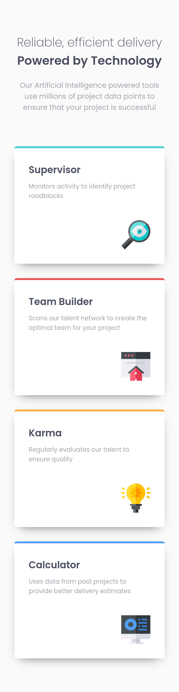

# Frontend Mentor - Four card feature section solution (Flexbox version)

This is a solution to the [Four card feature section challenge on Frontend Mentor](https://www.frontendmentor.io/challenges/four-card-feature-section-weK1eFYK).
## Table of contents

- [Overview](#overview)
  - [The challenge](#the-challenge)
  - [Screenshot](#screenshot)
    - [Desktop](#desktop)
    - [Tablet (~768 pixels width)](#tablet-768-pixels-width)
    - [Cellphone (~375 pixels width)](#cellphone-375-pixels-width)
  - [Links](#links)
- [My process](#my-process)
  - [Built with](#built-with)
  - [What I learned](#what-i-learned)
    - [2024/06/06](#20240606)
    - [2024/06/05](#20240605)
  - [Continued development](#continued-development)
  - [Useful resources](#useful-resources)
- [Author](#author)
- [Acknowledgments](#acknowledgments)

## Overview

### The challenge

Users should be able to:

- View the optimal layout for the site depending on their device's screen size

### Screenshot

#### Desktop

#### Tablet (~768 pixels width)

#### Cellphone (~375 pixels width)

### Links

- Live Site URL: [https://oczywsziysya.github.io/fem-four-card-feature-section](https://oczywsziysya.github.io/fem-four-card-feature-section)

## My process

### Built with

- Semantic HTML5 markup
- CSS custom properties
- Flexbox

### What I learned

#### 2024/06/06
The Grid version of this project is ready, check the ['grid-version' branch](https://github.com/Oczywsziysya/fem-four-card-feature-section/tree/grid-version).

#### 2024/05/06

This project forced me to try to get the most out of Flexbox. Yes, I know Grid would be ideal for this one and I'll definitely get to it in the near future, but I really wanted to see what are the limitations of Flexbox and I think the best way to do it is by using Flexbox to build a layout for which Grid would be better, get the most out of its features and then try to solve the problems that will arise (they *definitely* will).

As far as layout is concerned, the desktop and cellphone version look almost perfect. The tablet version is good too, one small issue: the cards' order should be a *little* different, but I couldn't think of a way to do this with Flexbox... The order is correct for desktop and cellphone, though.

For this one I also had to use more media-queries than before, mainly because of the font-size for the header, but I feel like this wouldn't be necessary if I used relative length units instead of pixels? In the next project I'll finally try to handle font-sizes differently.

### Continued development

* Write cleaner and concise CSS code.
* It's time to learn Grid, I can't run away from it anymore XD.
* Learn to use stuff like rem/em/clamp() for responsive typography.
* Get better at responsive layouts.

### Useful resources

- [Simple solutions to responsive typography by Kevin Powell](https://www.youtube.com/watch?v=wARbgs5Fmuw&ab_channel=KevinPowell)
- [An Interactive Guide to CSS Grid by Josh Comeau](https://www.joshwcomeau.com/css/interactive-guide-to-grid/)
- [CSS Grid Garden](https://cssgridgarden.com/)

## Author

- Frontend Mentor profile - [@Oczywsziysya](https://www.frontendmentor.io/profile/Oczywsziysya)
