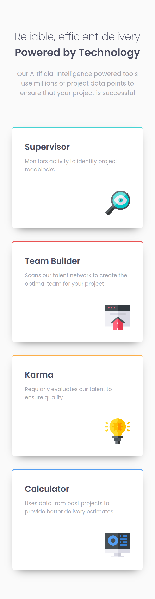

# Frontend Mentor - Four card feature section solution (Grid version)

This is a solution to the [Four card feature section challenge on Frontend Mentor](https://www.frontendmentor.io/challenges/four-card-feature-section-weK1eFYK).
## Table of contents

- [Overview](#overview)
  - [The challenge](#the-challenge)
  - [Screenshot](#screenshot)
    - [Desktop](#desktop)
    - [Tablet (~768 pixels width)](#tablet-768-pixels-width)
    - [Cellphone (~375 pixels width)](#cellphone-375-pixels-width)
  - [Links](#links)
- [My process](#my-process)
  - [Built with](#built-with)
  - [What I learned](#what-i-learned)
  - [Continued development](#continued-development)
  - [Useful resources](#useful-resources)
- [Author](#author)
- [Acknowledgments](#acknowledgments)

## Overview

### The challenge

Users should be able to:

- View the optimal layout for the site depending on their device's screen size

### Screenshot

#### Desktop

#### Tablet (~768 pixels width)

#### Cellphone (~375 pixels width)

### Links

- Live Site URL: [https://oczywsziysya-fem-05-grid.netlify.app](https://oczywsziysya-fem-05-grid.netlify.app)

There's no deploy for the Grid version yet.

## My process

### Built with

- Semantic HTML5 markup
- CSS custom properties
- Flexbox
- Grid

### What I learned

Initially I made a Flexbox version of this project. This branch contains my solution after learning the basics of CSS Grid!

In the Flexbox version, the cards' order for the tablet version was incorrect because I wasn't able to fix it using only Flexbox, but now that I used Grid the problem is gone, the order is correct! And it looks *exactly* the same, I just changed some media-query breakpoints a tiny bit, but the rest didn't change. Now that I'm much more aware of the limitations of Flexbox, I can appreciate Grid even more! 

### Continued development

* Write cleaner and concise CSS code.
* Go beyond the basics and learn more advanced CSS Grid techniques.
* Learn to use stuff like rem/em/clamp() for responsive typography.
* Get better at responsive layouts.

### Useful resources

- [Simple solutions to responsive typography by Kevin Powell](https://www.youtube.com/watch?v=wARbgs5Fmuw&ab_channel=KevinPowell)
- [An Interactive Guide to CSS Grid by Josh Comeau](https://www.joshwcomeau.com/css/interactive-guide-to-grid/)
- [CSS Grid Garden](https://cssgridgarden.com/)

## Author

- Frontend Mentor profile - [@Oczywsziysya](https://www.frontendmentor.io/profile/Oczywsziysya)
