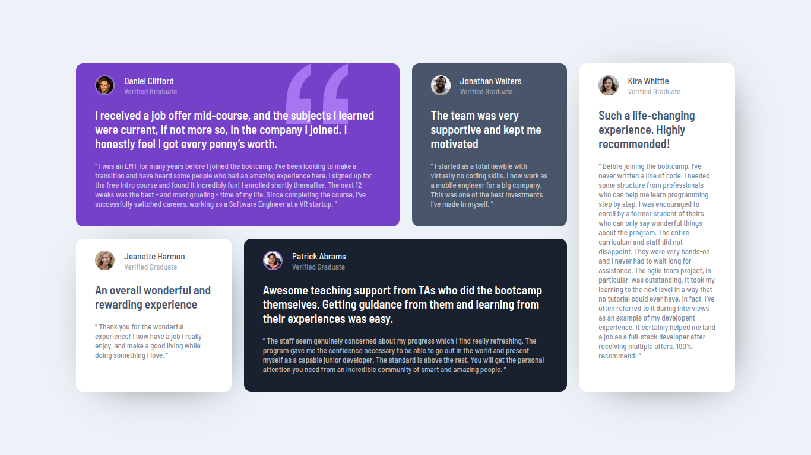
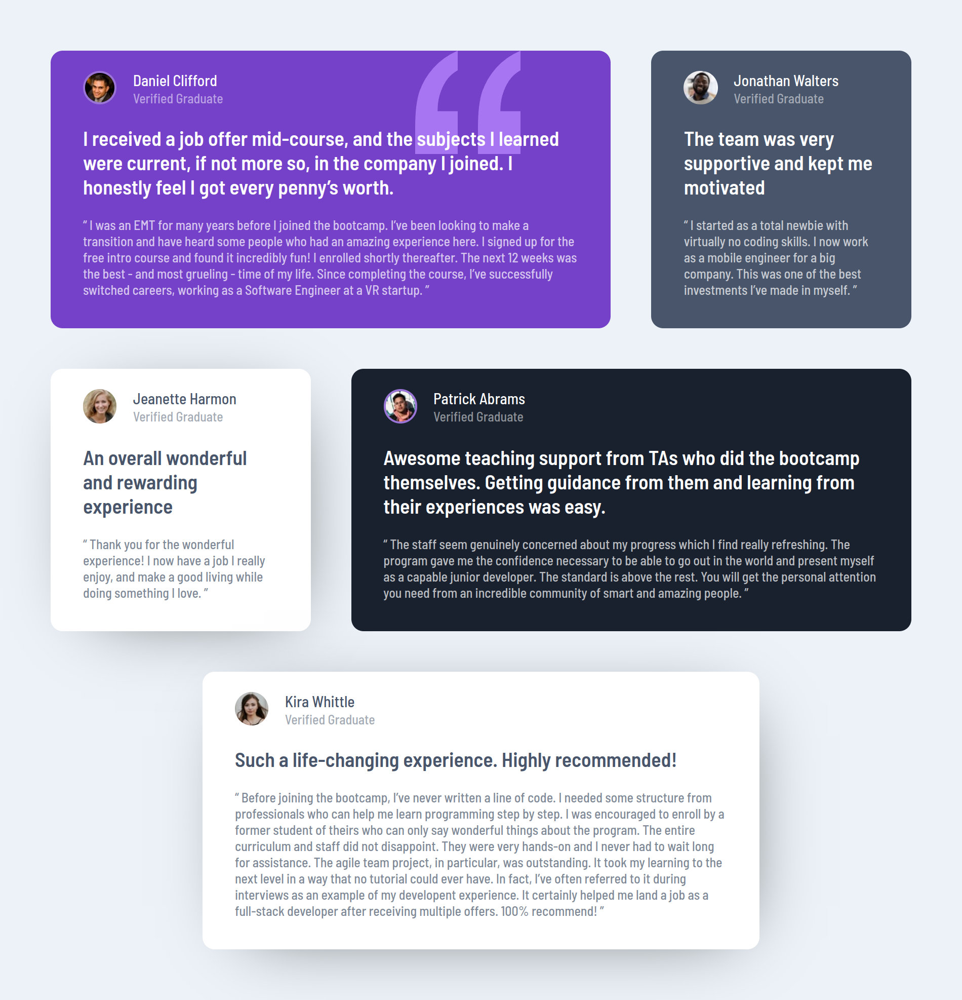
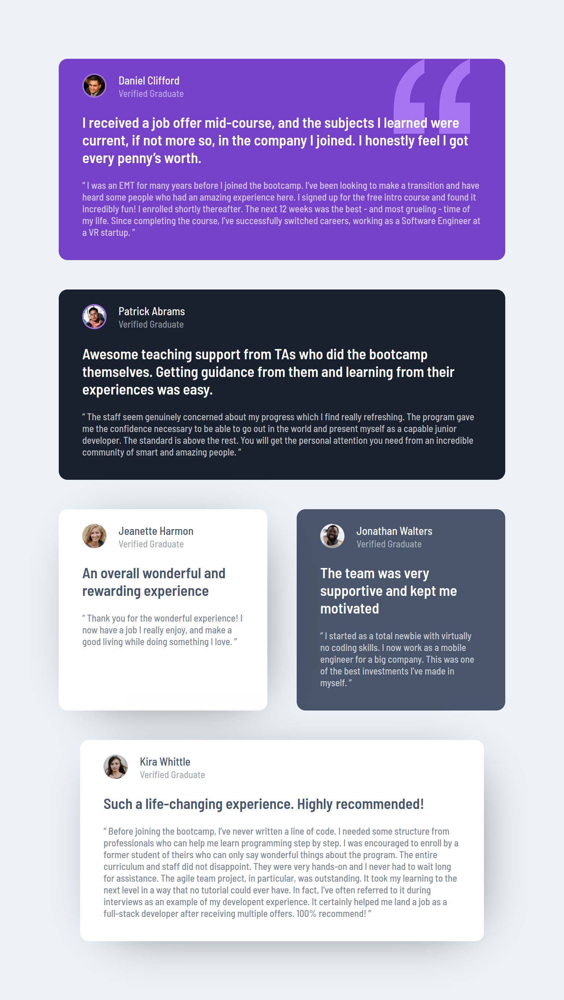

# Frontend Mentor - Testimonials grid section solution

This is a solution to the [Testimonials grid section challenge on Frontend Mentor](https://www.frontendmentor.io/challenges/testimonials-grid-section-Nnw6J7Un7).

## Table of contents

- [Overview](#overview)
  - [The challenge](#the-challenge)
  - [Screenshot](#screenshot)
    - [Desktop (~1366 pixels width)](#desktop-1366-pixels-width)
    - [Desktop (~950 pixels width)](#desktop-950-pixels-width)
    - [Tablet (~768 pixels width)](#tablet-768-pixels-width)
    - [Cellphone (~375 pixels width)](#cellphone-375-pixels-width)
  - [Links](#links)
- [My process](#my-process)
  - [Built with](#built-with)
  - [What I learned](#what-i-learned)
    - [Grid structure](#grid-structure)
    - [Positioned layout basics](#positioned-layout-basics)
  - [Continued development](#continued-development)
  - [Useful resources](#useful-resources)
- [Author](#author)

## Overview

### The challenge

Users should be able to:

- View the optimal layout for the site depending on their device's screen size

### Screenshot

#### Desktop (~1366 pixels width)

#### Desktop (~950 pixels width)

#### Tablet (~768 pixels width)

#### Cellphone (~375 pixels width)

### Links

- Live Site URL: [https://oczywsziysya.github.io/fem-testimonials-grid-section](https://oczywsziysya.github.io/fem-testimonials-grid-section)

## My process

### Built with

- Semantic HTML5 markup
- CSS custom properties
- Flexbox
- CSS Grid
- Positioned layout

### What I learned

#### Grid structure
I spent the last two days getting to grips with Grid, and this project was great to apply all this knowledge. I learned about how to structure the grid, what are the grid lines and grid tracks, how to define columns and rows, the difference between the explicit and implicit grid, how to assign items to the grid with `grid-template-areas` or `grid-column` and `grid-row`, how to position the columns and rows with `justify-content` (to organize the columns) and `align-content` (to organize the rows), how to position an item inside its cell with `justify-items` (to horizontally position the children inside its cell) and `align-items` (to vertically position the children inside its cell). To position an individual item, one can use `justify-self` and `align-self`. These are the main concepts I used for this project.

#### Positioned layout basics
The card with Daniel's review has this quotation mark symbol that overlaps the text, but you can read the text through it anyways. I didn't know how to handle this at first. There were two problems: how to position the symbol and how to make it partially transparent. A long time ago I was messing around with HTML/CSS because I wanted to code a personal blog, but I wasn't too serious about it so my knowledge was very scattered, I knew some things existed and had a *very* superficial understanding of them, but this was enough for me to remember the existence of the positioned layout mode/z-index and perceive it as a possible solution. After some time playing and experimenting with `position: absolute`, `position: relative` and `z-index` I got the job done, even though I had to create some media-queries because the symbol's position would change a little too much as I resize the window. 

At first I thought that changing the symbol's image opacity was the way to achieve the desired transparency, but this was making the text look less vivid, which doesn't match the design. After some time trying to wrap my head around it without success, it occured to me that maybe `z-index` would help. So I set `position: relative` (so that the `z-index` property will be valid) and `z-index: 2` to the text, while the symbol has `z-index: 1` and it worked! 

This basic knowledge was enough for me to complete the challenge, however, it's crystal clear that I have so much to learn about the positioned layout and stacking contexts, and for the next couple of days this is exactly what I'll be learning.

### Continued development

* Write semantically correct HTML.
* Write cleaner and concise CSS code.
* Learn more advanced things about CSS Grid.
* Learn about the positioned layout and stacking contexts.
* Learn about opacity and how to make cool things with it.
* Deepen my knowledge about images in CSS.

### Useful resources

- [An Interactive Guide to Grid by Josh Comeau](https://www.joshwcomeau.com/css/interactive-guide-to-grid/) - Absolutely fantastic and beautiful.
- [Understanding Layout Algorithms by Josh Comeau](https://www.joshwcomeau.com/css/understanding-layout-algorithms/) - After reading this article a couple of times I feel like my mental model for CSS is much more solid and as a consequence the behaviour of the page is becoming less unpredictable (this is exactly what makes CSS so frustrating for so many people).
- [Lower the opacity of a background-image with CSS by Kevin Powell](https://www.youtube.com/watch?v=lRPguPbovro&ab_channel=KevinPowell)
- [CSS position deep dive by Kevin Powell](https://www.youtube.com/watch?v=fF_NVrd1s14&ab_channel=KevinPowell)
- [z-index and stacking context explained by Kevin Powell](https://www.youtube.com/watch?v=uS8l4YRXbaw&ab_channel=KevinPowell)
- [Learn CSS Grid the easy way by Kevin Powell](https://www.youtube.com/watch?v=rg7Fvvl3taU&ab_channel=KevinPowell)

## Author

- Frontend Mentor profile - [@Oczywsziysya](https://www.frontendmentor.io/profile/Oczywsziysya)