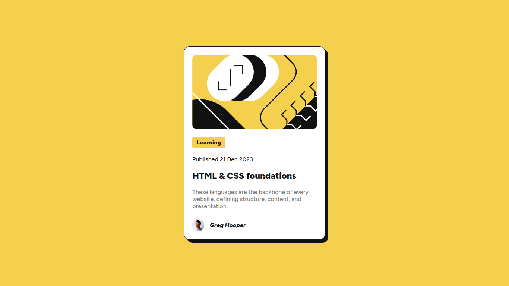
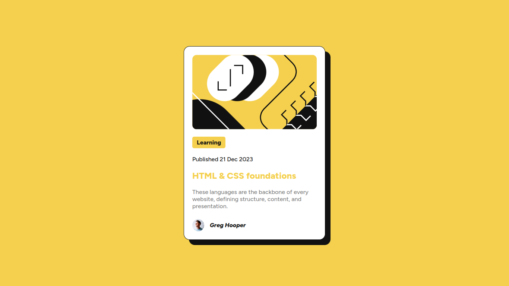
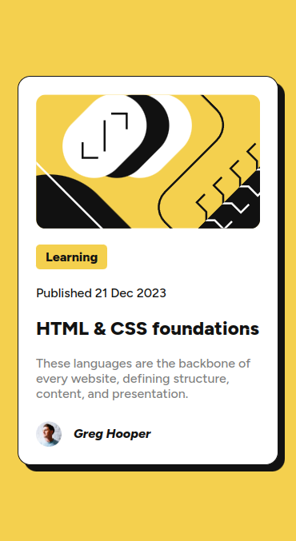
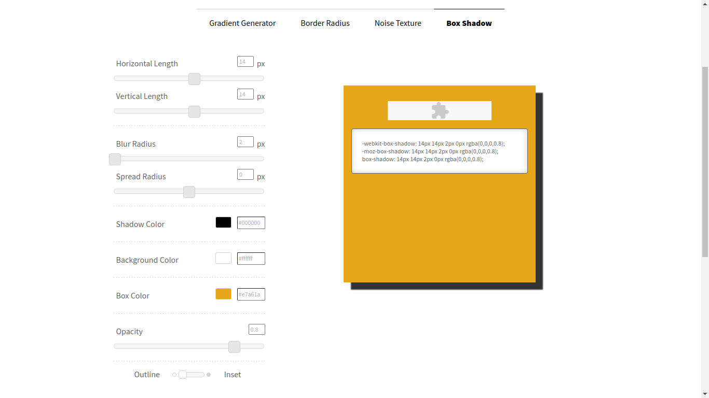

# Frontend Mentor - Blog preview card solution

This is a solution to the [Blog preview card challenge on Frontend Mentor](https://www.frontendmentor.io/challenges/blog-preview-card-ckPaj01IcS). 
## Table of contents

- [Overview](#overview)
  - [The challenge](#the-challenge)
  - [Screenshot](#screenshot)
    - [Desktop](#desktop)
    - [Desktop (active state)](#desktop-active-state)
    - [Mobile (~375 pixels width)](#mobile-375-pixels-width)
  - [Links](#links)
- [My process](#my-process)
  - [Built with](#built-with)
  - [What I learned](#what-i-learned)
    - [Custom properties (variables)](#custom-properties-variables)
    - [Box-shadow property](#box-shadow-property)
    - [Semantic HTML](#semantic-html)
  - [Continued development](#continued-development)
  - [Useful resources](#useful-resources)
- [Author](#author)

## Overview

### The challenge

Users should be able to:

- See hover and focus states for all interactive elements on the page

### Screenshot

#### Desktop
<div align="center"></div>

#### Desktop (active state)
<div align="center"></div>

#### Mobile (~375 pixels width)
<div align="center"></div>

### Links

- Live Site URL: [https://oczywsziysya-fem-07.netlify.app](https://oczywsziysya-fem-07.netlify.app)

## My process

### Built with

- Semantic HTML5 markup
- CSS custom properties
- Flexbox

### What I learned

#### Custom properties (variables)

Doing this project I learned the basics of custom properties (also called variables) 
in order to make the code more readable and "dry" (especially the color palette).

The custom properties are declared inside the :root selector. I also learned that 
the :root selector is the basically the same thing as the html one, but with higher 
specifity.

```css
:root {
    /* COLOR PALETTE */
  --yellow-color: hsl(47, 88%, 63%);
  --white-color: hsl(0, 0%, 100%);
  --grey-color: hsl(0, 0%, 50%);
  --black-color: hsl(0, 0%, 7%);
    
    /* FONTS */
  --regular-font: "Figtree";
  --italic-font: "Figtree Italic";
  --regular-font-weight: 500;
  --bold-font-weight: 800;
}
```

#### Box-shadow property

I learned about the box-shadow property and its parameters, like offset-x (places 
the shadow to the right of the element, can be negative), offset-y (places the 
shadow to the bottom of the element, can be negative), blur-radius and spread-radius 
(will cause the shadow to expand and grow bigger, can be negative to make it shrink). 

There are some [tools](https://www.cssmatic.com/box-shadow) available on the web 
that one can use to visually build the desired shadow effect.



#### Semantic HTML

Regarding HTML, I learned some semantic tags to indicate the publishing date and 
contact information/author of the content using the tags time, address and the 
attributes datetime="..."/rel="author". The rel attribute is used solely for giving 
the content meaning, so the browser can use it to Search Engine Optimization (SEO).

```html
  <time datetime="2023-12-21">Published 21 Dec 2023</time>

  <address>
    <a rel="author" href="https://example.com">Author's name</a>
  </address>
```

### Continued development

Some aspects that I want to refine for next projects:

* Semantic HTML
* How to get the most out of custom properties and when they should be avoided
* Responsive design
* Write cleaner and concise CSS

### Useful resources

- [MDN article on box-shadow](https://developer.mozilla.org/en-US/docs/Web/CSS/box-shadow)
- [MDN article on the <time> tag](https://developer.mozilla.org/en-US/docs/Web/HTML/Element/time) - It lists the accepted formats for the datetime attribute's value.
- [Interactive Guide to Flexbox by Josh Comeau](https://www.joshwcomeau.com/css/interactive-guide-to-flexbox/) - Amazing resource, really interactive and covers some 
very important concepts about Flexbox that are, very often, misunderstood/overlooked.
- [A Complete Guide to Custom Properties by CSS Tricks](https://css-tricks.com/a-complete-guide-to-custom-properties/)
- [A practical guide to responsive web design by Kevin Powell](https://www.youtube.com/watch?v=x4u1yp3Msao&ab_channel=KevinPowell) - Really useful video about responsive designs, 
the author highlights that media-queries are often misused/overused and that most of the time 
we can just give some hints to the browser and it will take care of the responsiveness. 


## Author

- Frontend Mentor profile - [@Oczywsziysya](https://www.frontendmentor.io/profile/Oczywsziysya)