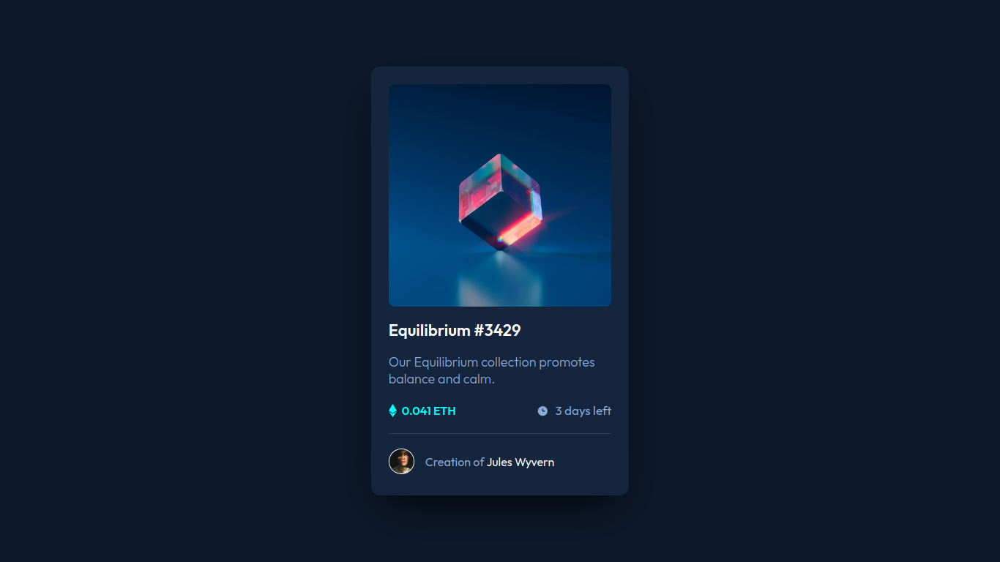
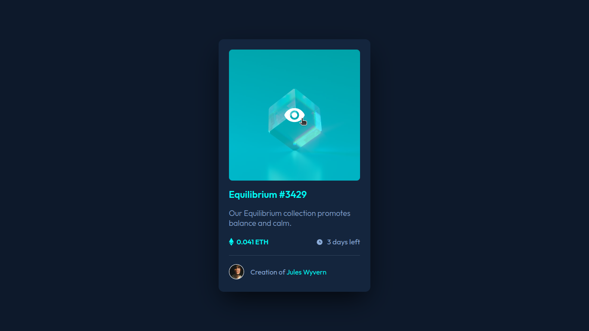
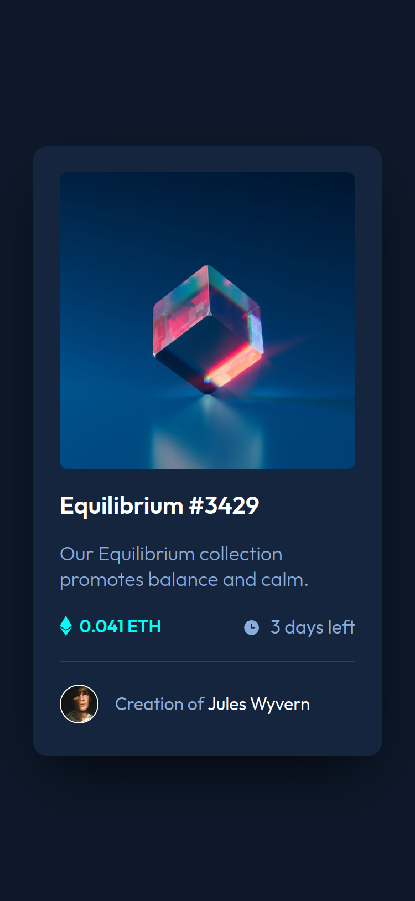

# Frontend Mentor - NFT preview card component solution

This is a solution to the [NFT preview card component challenge on Frontend Mentor](https://www.frontendmentor.io/challenges/nft-preview-card-component-SbdUL_w0U).

## Table of contents

- [Overview](#overview)
  - [The challenge](#the-challenge)
  - [Screenshot](#screenshot)
    - [Desktop](#desktop)
    - [Desktop (active states)](#desktop-active-state)
    - [Mobile (~375 pixels width)](#mobile-375-pixels-width)
  - [Links](#links)
- [My process](#my-process)
  - [Built with](#built-with)
  - [What I learned](#what-i-learned)
  - [Continued development](#continued-development)
- [Author](#author)

## Overview

### The challenge

Users should be able to:

- View the optimal layout depending on their device's screen size
- See hover states for interactive elements

### Screenshot

#### Desktop

#### Desktop (active state)

#### Mobile (~375 pixels width)

### Links

- Live Site URL: [https://oczywsziysya.github.io/fem-nft-preview-card-component](https://oczywsziysya.github.io/fem-nft-preview-card-component)

## My process

### Built with

- Semantic HTML5 markup
- CSS custom properties
- Flexbox

### What I learned

At first I thought that this challenge in specific had nothing new for me to learn, but it turned out that making the image's hover effect with that cyan-colored "view card" was not that simple, to say the least. I created a div with the view icon in the HTML immediately after the image inside the `<picture>` element, set its display to none, and then made it take form again for when the user hovers over the `<picture>` by giving it `position: absolute`, `width/height: 100%`, a cyan background color, etc. Then I used Flexbox to center the view icon inside the "view card". This is probably not the ideal solution, but that's all I'm able to do for now. A more clever solution to this problem would probably use pseudo-elements instead of having an extra element in the HTML file. 

I also learned some very simple animations for hover states to make it a little more pleasing to the eye, I intend to take some time to learn more about animations in the future.

### Continued development

* Write semantically correct HTML.
* Write cleaner and concise CSS code.
* Learn more about pseudo-elements and their use cases.
* Learn more about animations and transitions.

## Author

- Frontend Mentor profile - [@Oczywsziysya](https://www.frontendmentor.io/profile/@Oczywsziysya)
