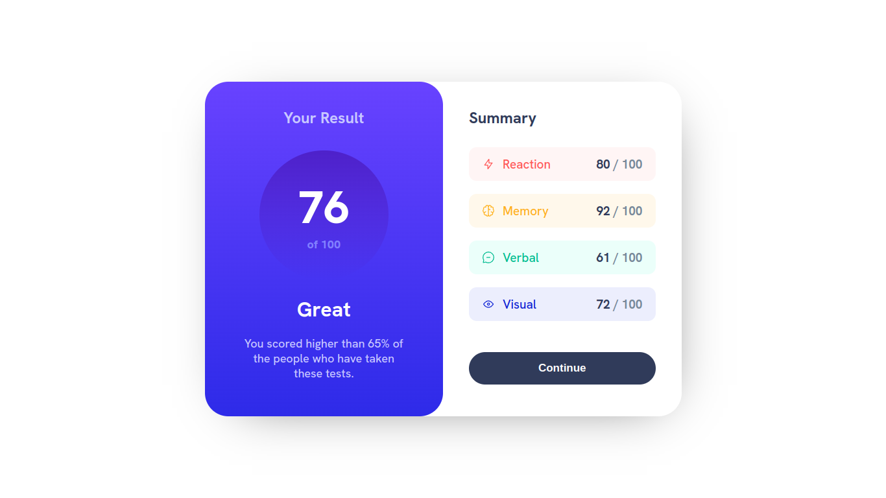
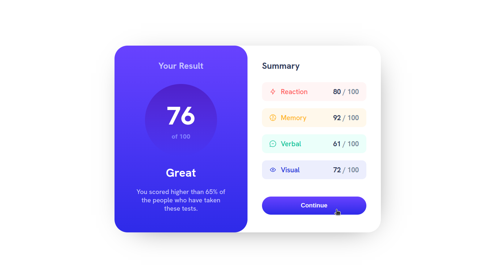
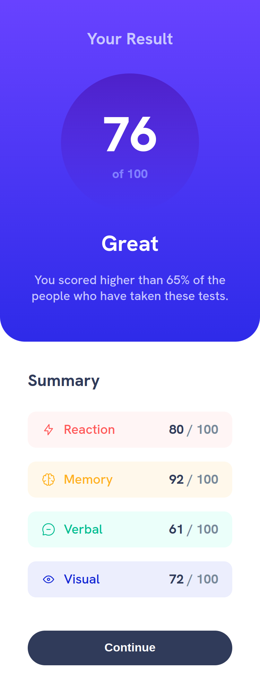

# Frontend Mentor - Results summary component solution

This is a solution to the [Results summary component challenge on Frontend Mentor](https://www.frontendmentor.io/challenges/results-summary-component-CE_K6s0maV).

## Table of contents

- [Overview](#overview)
  - [The challenge](#the-challenge)
  - [Screenshot](#screenshot)
    - [Desktop](#desktop)
    - [Desktop (active state)](#desktop-active-states)
    - [Mobile (~375 pixels width)](#mobile-375-pixels-width)
  - [Links](#links)
- [My process](#my-process)
  - [Built with](#built-with)
  - [What I learned](#what-i-learned)
  - [Continued development](#continued-development)
  - [Author](#author)

## Overview

### The challenge

Users should be able to:

- View the optimal layout for the interface depending on their device's screen size
- See hover and focus states for all interactive elements on the page
- **Bonus**: Use the local JSON data to dynamically populate the content

### Screenshot

#### Desktop

#### Desktop (active states)

#### Mobile (~375 pixels width)

### Links

- Live Site URL: [https://oczywsziysya-fem-09.netlify.app](https://oczywsziysya-fem-09.netlify.app)

## My process

### Built with

- Semantic HTML5 markup
- CSS custom properties
- Flexbox

### What I learned

* I learned to use linear gradients as a value to `background-image: ...`.

### Continued development

* Get better with colors in general and be able to tweak the hsl() parameters with ease to get the desired color.
* Write semantically correct HTML.
* Write cleaner and concise CSS code.

## Author

- Frontend Mentor profile - [@Oczywsziysya](https://www.frontendmentor.io/profile/Oczywsziysya)
