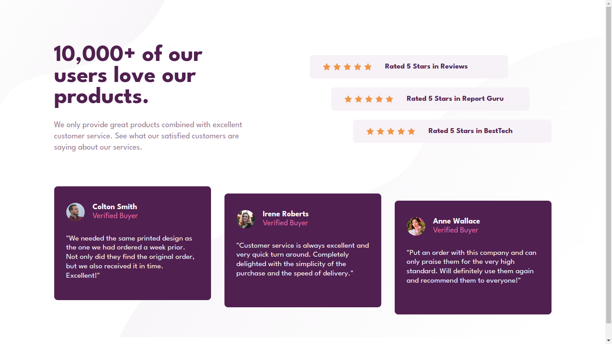
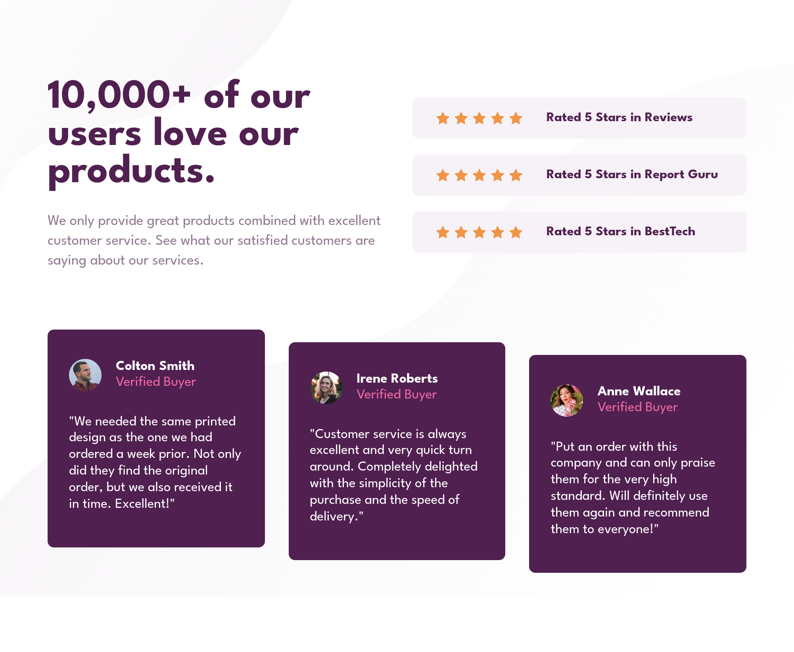
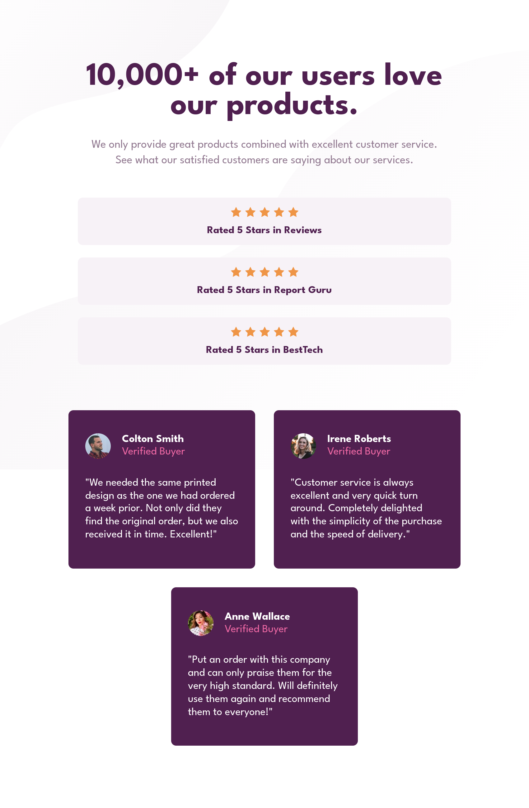
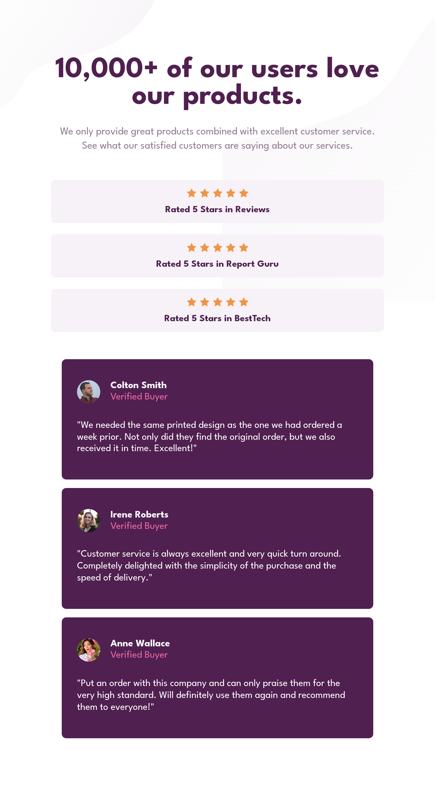
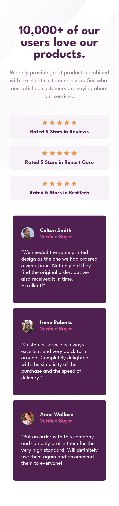

# Frontend Mentor - Social proof section solution

This is a solution to the [Social proof section challenge on Frontend Mentor](https://www.frontendmentor.io/challenges/social-proof-section-6e0qTv_bA).

## Table of contents

- [Overview](#overview)
  - [The challenge](#the-challenge)
  - [Screenshot](#screenshot)
    - [Desktop](#desktop)
    - [Desktop (~1000 pixels width)](#desktop-1000-pixels-width)
    - [Desktop (~850 pixels width)](#desktop-850-pixels-width)
    - [Tablet (~768 pixels width)](#tablet-768-pixels-width)
    - [Cellphone (~375 pixels width)](#cellphone-375-pixels-width)
  - [Links](#links)
- [My process](#my-process)
  - [Built with](#built-with)
  - [What I learned](#what-i-learned)
    - [About responsiveness](#about-responsiveness)
    - [Background images](#background-images)
  - [Continued development](#continued-development)
- [Author](#author)

## Overview

### The challenge

Users should be able to:

- View the optimal layout for the section depending on their device's screen size

### Screenshot

#### Desktop

#### Desktop (~1000 pixels width)

#### Desktop (~850 pixels width)

#### Tablet (~768 pixels width)

#### Cellphone (~375 pixels width)

### Links

- Live Site URL: [https://oczywsziysya-fem-12.netlify.app](https://oczywsziysya-fem-12.netlify.app)

## My process

### Built with

- Semantic HTML5 markup
- CSS custom properties
- Flexbox

### What I learned

#### About responsiveness
Personally I think that, compared to the previous challenges, making this one responsive across multiple screen sizes was harder, but I tried my best and added a significant amount of breakpoints to try to handle everything.

I also conducted a little experiment here. Instead of adding all the media-queries at the end of the CSS file, I thought that maybe if I write them close to the block they modify the code would be more readable. When they're all placed at the end, I constantly need to scroll up, find the selector and the properties, scroll down again and write the stuff for responsiveness. 

The obvious downside to this is that one needs to write multiple media-queries at different spots for the same breakpoint, but I do think it improved readability and it was easier for me to find the selectors and properties I needed.

The thing is: is this bad practice? I mean, even if it does improve readability, maybe we can run into some performance issues because of the multiple media-queries? I don't know, I guess some research has to be done.

#### Background images
I learned that a container can have multiple background images and each of them can be given different properties (eg. `background-repeat`, `background-position`, `background-attachment`, etc.). I really couldn't get the background images to match the design, though. Tried tweaking the position parameters, but no success. Also, things would get weird as I resize the window and I tried adding `background-attachment: fixed;` to fix this. It worked at some points, but again, it does not match the intended design.

### Continued development

* Write semantically correct HTML.
* Write cleaner and concise CSS code.
* Learn more about best practices when using media-queries.
* Get better at building responsive designs.
* Learn more about background related properties and try to fix them in this project.

## Author

- Frontend Mentor profile - [@Oczywsziysya](https://www.frontendmentor.io/profile/Oczywsziysya)