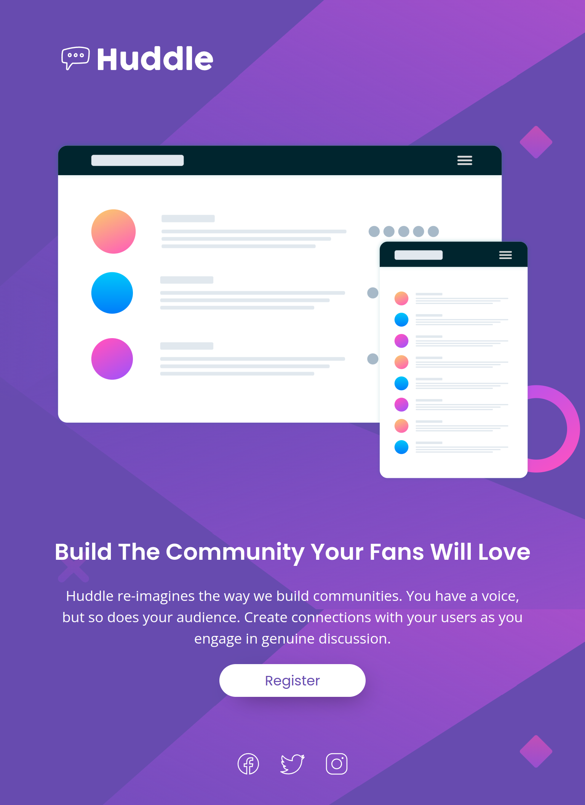

# Frontend Mentor - Huddle landing page with single introductory section solution

This is a solution to the [Huddle landing page with single introductory section challenge on Frontend Mentor](https://www.frontendmentor.io/challenges/huddle-landing-page-with-a-single-introductory-section-B_2Wvxgi0).

## Table of contents

- [Overview](#overview)
  - [The challenge](#the-challenge)
  - [Screenshot](#screenshot)
    - [Desktop](#desktop)
    - [Desktop (active state)](#desktop-active-state)
    - [Desktop (~1000 pixels width)](#desktop-1000-pixels-width)
    - [Tablet (~768 pixels width)](#tablet-768-pixels-width)
    - [Cellphone (~375 pixels width)](#cellphone-375-pixels-width)
  - [Links](#links)
- [My process](#my-process)
  - [Built with](#built-with)
  - [Continued development](#continued-development)

## Overview

### The challenge

Users should be able to:

- View the optimal layout for the page depending on their device's screen size
- See hover states for all interactive elements on the page

### Screenshot

#### Desktop

#### Desktop (active state)

#### Desktop (~1000 pixels width)

#### Tablet (~768 pixels width)

#### Cellphone (~375 pixels width)

### Links

- Live Site URL: [https://oczywsziysya.github.io/fem-huddle-page-single-introductory-section](https://oczywsziysya.github.io/fem-huddle-page-single-introductory-section)

## My process

### Built with

- Semantic HTML5 markup
- CSS custom properties
- Flexbox

### Continued development

* Write semantically correct HTML.
* Write clean and concise CSS code.
* Get better at responsive layouts.
* Learn more about best practices for using media-queries.
* Learn more about SVG images and how to interact with them through CSS.

## Author

- Frontend Mentor profile - [@Oczywsziysya](https://www.frontendmentor.io/profile/Oczywsziysya)