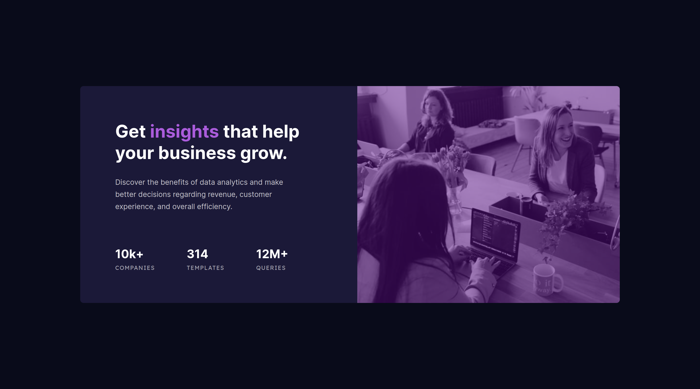
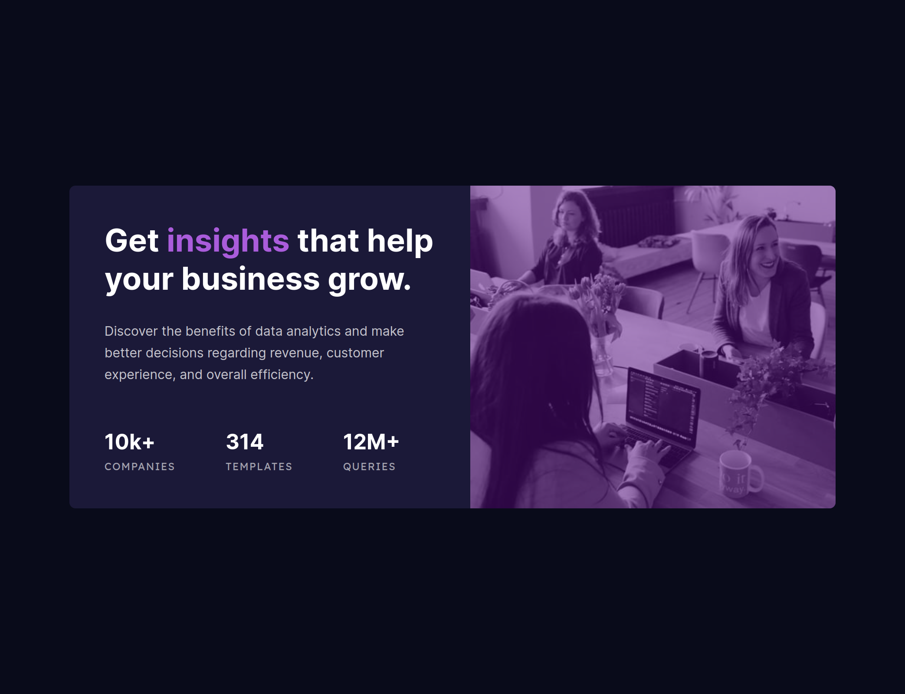
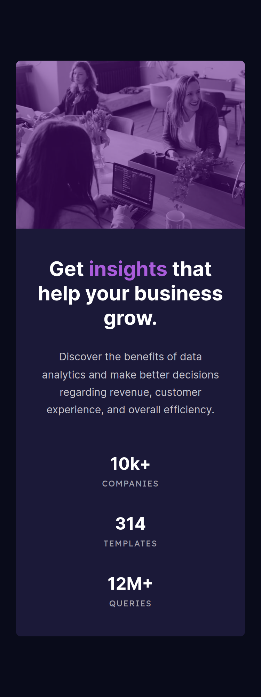

# Frontend Mentor - Stats preview card component solution

This is a solution to the [Stats preview card component challenge on Frontend Mentor](https://www.frontendmentor.io/challenges/stats-preview-card-component-8JqbgoU62).

## Table of contents

- [Overview](#overview)
  - [The challenge](#the-challenge)
  - [Screenshot](#screenshot)
    - [Desktop (~1440 pixels width)](#desktop-1440-pixels-width)
    - [Desktop (~1040 pixels width)](#desktop-1040-pixels-width)
    - [Tablet (~768 pixels width)](#tablet-768-pixels-width)
    - [Cellphone (~375 pixels width)](#cellphone-375-pixels-width)
  - [Links](#links)
- [My process](#my-process)
  - [Built with](#built-with)
  - [Continued development](#continued-development)
- [Author](#author)

## Overview

### The challenge

Users should be able to:

- View the optimal layout depending on their device's screen size

### Screenshot

#### Desktop (~1440 pixels width)

#### Desktop (~1040 pixels width)

#### Tablet (~768 pixels width)

#### Cellphone (~375 pixels width)

### Links

- Live Site URL: [https://oczywsziysya-fem-16.netlify.app](https://oczywsziysya-fem-16.netlify.app)

## My process

### Built with

- Semantic HTML5 markup
- CSS custom properties
- Flexbox
- CSS clamp
- Native CSS nesting

### Continued development

* Write semantically correct HTML.
* Write clean and concise CSS code.
* Learn more about fluid layouts the techniques to implement them.
* Learn more about the mix-blend-mode property (without this, the color overlay in this project wouldn't look as intended).

## Author

- Frontend Mentor profile - [@Oczywsziysya](https://www.frontendmentor.io/profile/Oczywsziysya)
